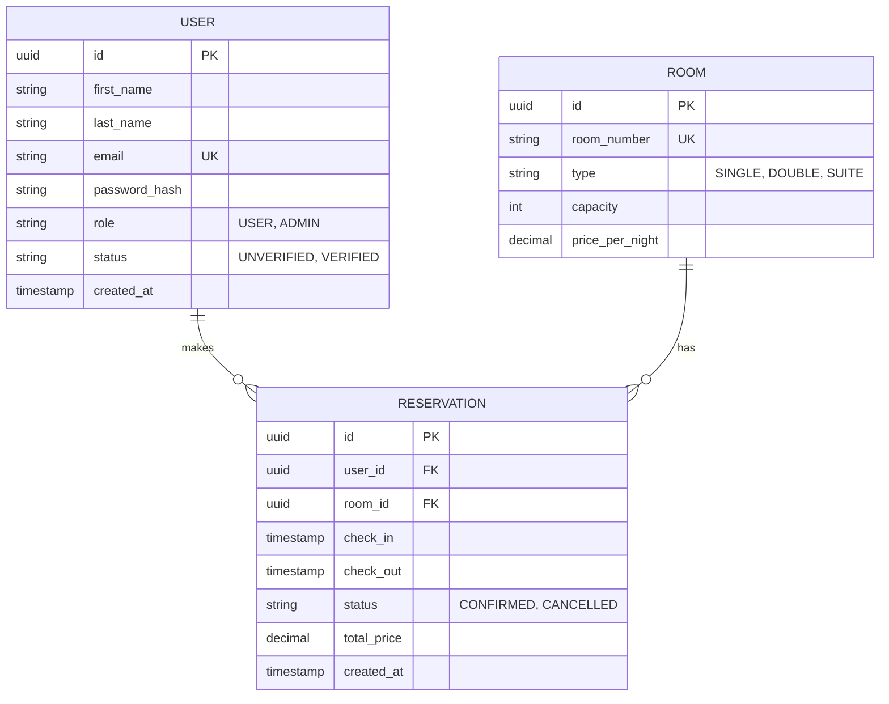

# Arquitectura de Base de Datos | HotelAdministration

## Motor Recomendado
Se utilizará una base de datos relacional PostgreSQL debido a la naturaleza transaccional de las reservas y la necesidad de mantener consistencia ACID.

## Entidades Principales y Relaciones

### 1. User
Almacena la información de autenticación y datos personales de los clientes y administradores.
- **Relaciones:** Un usuario puede tener muchas reservas (1:N).

### 2. Room
Almacena la información del catálogo de habitaciones (número, tipo, capacidad, precio base).
- **Relaciones:** Una habitación puede tener muchas reservas a lo largo del tiempo (1:N).

### 3. Reservation
Entidad pivote que registra el alquiler temporal de una habitación por un usuario.
- **Relaciones:**
  - Pertenece a un único `User` (N:1).
  - Está asignada a una única `Room` (N:1).

## Diagrama Entidad-Relación (ERD)

